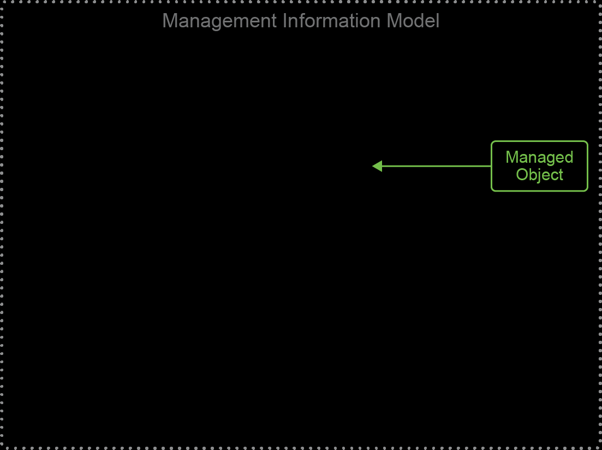

# UCS Manager Management Information Model (MIM)

## Overview
The Cisco UCS Manager uses a **Management Information Model (MIM)** to represent all the managed objects (MOs) in the system. The MIM structure organizes the physical and logical components of the UCS environment hierarchically.

Below is an illustration of the MIM structure with an example that shows a system containing **five chassis** and the associated components.

### Figure 1. Illustration of MIM Structure Showing Five Chassis



*Figure 1: A visual representation of the Management Information Model (MIM) highlighting the relationships between managed objects within the UCS environment.*

---

### MIM Tree Structure (Top Root: `sys`)
The MIM hierarchy starts with the top-level **`sys`** distinguished name (DN), which represents the UCS system. Each chassis, blade, rack unit, and adapter is represented by a unique DN in the hierarchy. 

```
Tree (topRoot):—————————————-Distinguished Name:

|——sys———————————––– (sys)
     |——chassis-1————————(sys/chassis-1)
     |——chassis-2————————(sys/chassis-2)
     |——chassis-3————————(sys/chassis-3)
     |——chassis-4————————(sys/chassis-4)
     |——chassis-5————————(sys/chassis-5)
          |——rackunit-1————(sys/chassis-5/rackunit-1)
          |——blade-1————— (sys/chassis-5/blade-1)
               |——adaptor-1—– (sys/chassis-5/blade-1/adaptor-1)
          |——blade-2————— (sys/chassis-5/blade-2)
               |——adaptor-1—– (sys/chassis-5/blade-2/adaptor-1)
               |——adaptor-2—– (sys/chassis-5/blade-2/adaptor-2)
          |——blade-3————— (sys/chassis-5/blade-3)
               |——adaptor-1—– (sys/chassis-5/blade-3/adaptor-1)
               |——adaptor-2—– (sys/chassis-5/blade-3/adaptor-2)
          |——blade-4————— (sys/chassis-5/blade-4)
               |——adaptor-1—– (sys/chassis-5/blade-4/adaptor-1)
          |——blade-5————— (sys/chassis-5/blade-5)
               |——adaptor-1—– (sys/chassis-5/blade-5/adaptor-1)
               |——adaptor-2—– (sys/chassis-5/blade-5/adaptor-2)
          |——blade-6————— (sys/chassis-5/blade-6)
               |——adaptor-1—– (sys/chassis-5/blade-6/adaptor-1)
          |——blade-7————— (sys/chassis-5/blade-7)
               |——adaptor-1—– (sys/chassis-5/blade-7/adaptor-1)
          |——blade-8————— (sys/chassis-5/blade-8)
               |——adaptor-1—– (sys/chassis-5/blade-8/adaptor-1)
```

### Key Concepts
1. **Managed Object (MO):**
   - Each element in the hierarchy (e.g., `sys`, `chassis`, `blade`, `rackunit`, `adaptor`) is a managed object.
   - Each MO has a unique **Distinguished Name (DN)**, which identifies its location in the MIM hierarchy.

2. **Chassis:**
   - Represents a physical chassis in the UCS system.
   - Example: `sys/chassis-5` represents the fifth chassis.

3. **Rack Unit:**
   - Represents a physical rack unit that contains blades or other components.
   - Example: `sys/chassis-5/rackunit-1` represents the first rack unit in chassis 5.

4. **Blade:**
   - Represents a server blade within a chassis.
   - Example: `sys/chassis-5/blade-3` represents the third blade in chassis 5.

5. **Adaptor:**
   - Represents a network or storage adapter in a blade.
   - Example: `sys/chassis-5/blade-3/adaptor-2` represents the second adapter in blade 3 of chassis 5.

### Summary
The hierarchical structure of the UCS MIM makes it easier to navigate and manage all physical and logical components in a UCS system. Each component's unique DN provides an intuitive and standardized way to reference objects in the system.

https://developer.cisco.com/learning/modules/ucs-python-sdk-introduction/ucsm-python-sdk-103/generate-python-code/
https://ucsmsdk.readthedocs.io/en/latest/ucsmsdk_ug.html#creating-objects
https://www.cisco.com/c/en/us/td/docs/unified_computing/ucs/sw/api/b_ucs_api_book/b_ucs_api_book_chapter_010.html#r_lsinstantiatennamedtemplate
